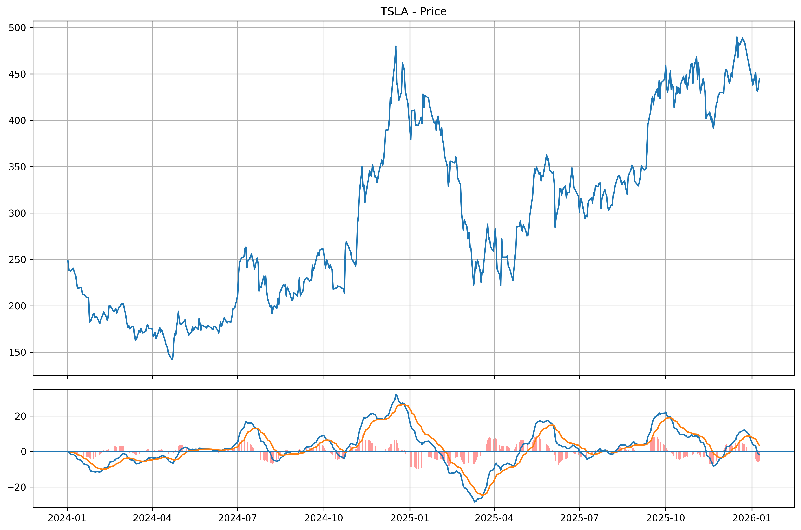
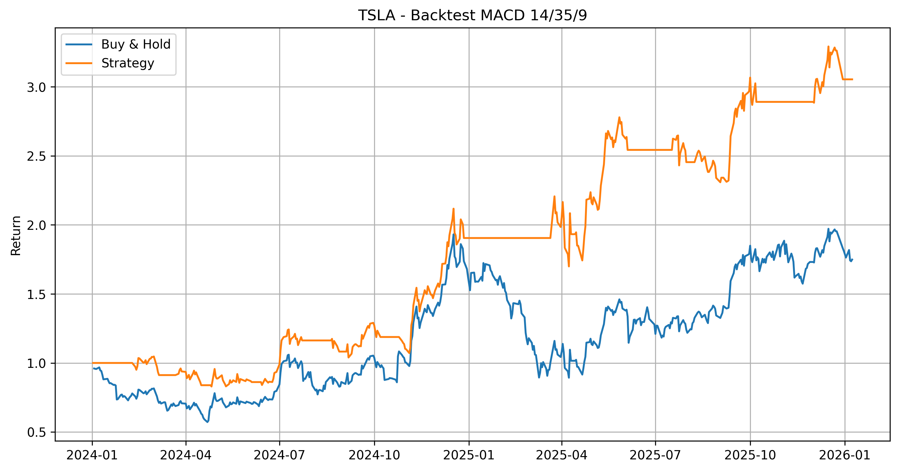
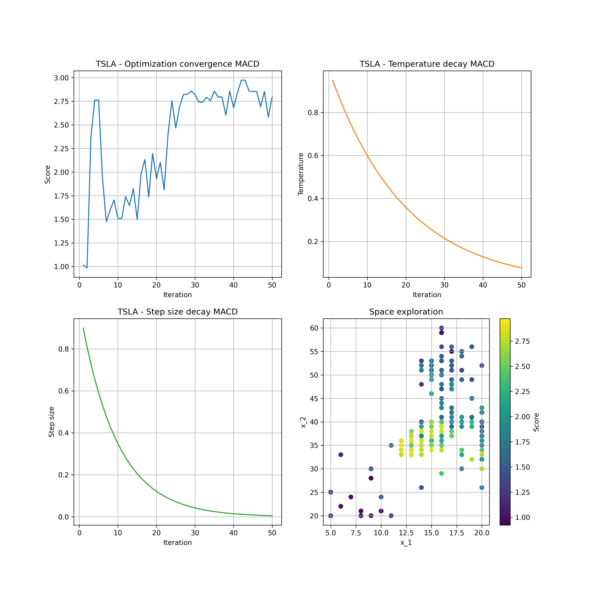
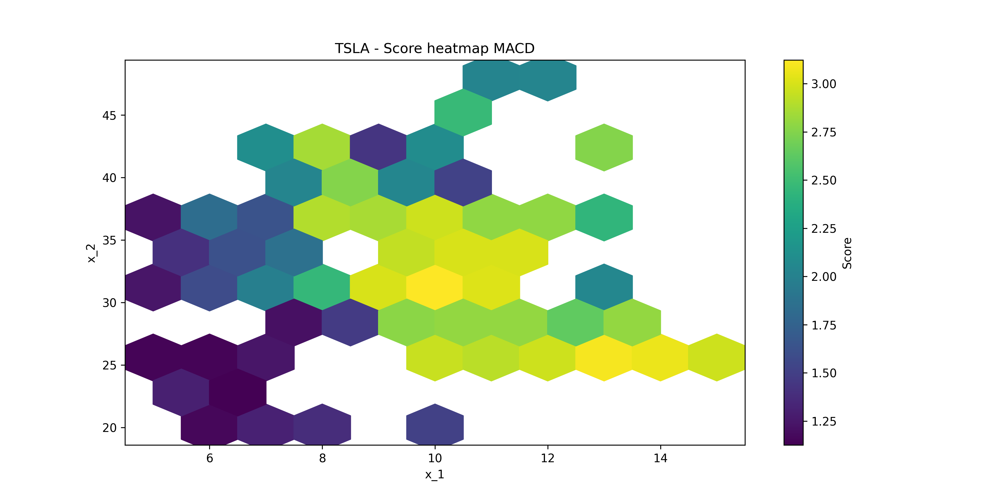

# Trading Strategy Optimizer

This project provides a Python script for **backtesting and heuristic optimization of trading strategies based on technical indicators**, being applied to spot market time series.

As main advantages, the project provides:
- **simulated annealing algorithm** to perform a global search for the best strategies. 
- creation of **spreadsheets and figures with performance results** from backtesting and optimization procedure.
- **open-source code**, allowing **flexibility in adjusting the search space** and **implementing technical indicators**.


## 🗂 Project Structure

The project is organized around a modular pipeline, where each class has a responsibility:

- **Loader** handles configuration files for tickers and market settings.
- **Indicator** applies technical indicators (MA crossover, Bollinger Bands, MACD) and generates trading signals.
- **Backtester** evaluates strategies on historical data and computes performance metrics.
- **Optimizer** searches the indicator parameter space using heuristic optimization.
- **Strategies** scores and ranks candidate strategies based on configurable objective functions.


The project has the following structure:

 ```text
 trading_strategy_optimizer/ 
 │  
 ├── trading_strategy_optimizer.py 
 |  
 ├── core/   
 │   ├── __init__.py  
 │   ├── loader.py  
 │   ├── indicator.py  
 │   ├── backtester.py  
 │   ├── optimizer.py  
 │   ├── strategies.py  
 │   ├── exporter.py  
 │   └── notifier.py  
 │  
 ├── config/  
 │   ├── config.json  
 │   └── tickers.json  
 │  
 ├── data/  
 │   └── results/ 
 |       ├── best_results.xlsx 
 │       ├── strategies.csv  
 │       ├── backtests.png   
 │       └── logs.txt   
 │  
 ├── images/
 ├── requirements.txt  
 ├── README.md  
 └── LICENSE  
 ```

## 📈 Available Strategies

The project currently supports the following indicators:
- **Moving Average crossover** using:
  - **SMA (Simple Moving Average)**;
  - **EMA (Exponential Moving Average)**;
  - **WMA (Weighted Moving Average)**.
- **Bollinger bands**;
- **Moving Average Convergence/Divergence (MACD)**.

## ⚙️ How to Use

1. **Install dependencies**:
   ```bash
    pip install pandas
    pip install numpy
    pip install yfinance
    pip install requests
    ```

2. **Configure parameters and tickers**
   - In `config/config.json` add the configuration parameters.
   - In `config/tickers.json` add the stock symbols to analyze, one per line.

3. **Run the script**
   - To run the optimization with backtests, execute:
     ```bash
     python trading_strategy_optimizer.py
     ```

## 🧩 Output Examples

- **Backtest charts for MACD strategy**
  
  After running `trading_strategy_optimizer.py` optimization it is generated strategy charts, spreadsheets for each ticker, and a summary with best results. The generated figures follow the example:

  <p align="center">
    
    
  </p>

  Notice that the asset ends the evaluated periodo at 1.75 times its initial price, so a Buy & hold strategy would yield 175% return. On the other hand, strictly following the MACD 20/28/9 strategy would produce above 300% return over the same period, excluding any transactions fees.

- **Optimization log and charts for MACD strategy**

  After running `trading_strategy_optimizer.py` it is generated optimization logs and charts, for each ticker, are. The generated files follow the example:

  ```txt
  k = 1: x = {'ind_t': 'MACD', 'ind_p': [5, 26, 9]} | f(x) = 1.0535 | T = 0.95 | alpha = 0.90
  k = 2: x = {'ind_t': 'MACD', 'ind_p': [8, 20, 10]} | f(x) = 1.3766 | T = 0.90 | alpha = 0.81
  k = 3: x = {'ind_t': 'MACD', 'ind_p': [6, 35, 10]} | f(x) = 1.8316 | T = 0.86 | alpha = 0.73
  k = 4: x = {'ind_t': 'MACD', 'ind_p': [5, 33, 5]} | f(x) = 1.0936 | T = 0.81 | alpha = 0.66
  k = 5: x = {'ind_t': 'MACD', 'ind_p': [6, 21, 8]} | f(x) = 0.9848 | T = 0.77 | alpha = 0.59
  k = 6: x = {'ind_t': 'MACD', 'ind_p': [7, 24, 8]} | f(x) = 1.2401 | T = 0.74 | alpha = 0.53
  k = 7: x = {'ind_t': 'MACD', 'ind_p': [8, 41, 9]} | f(x) = 1.4409 | T = 0.70 | alpha = 0.48
  k = 8: x = {'ind_t': 'MACD', 'ind_p': [11, 45, 10]} | f(x) = 2.4746 | T = 0.66 | alpha = 0.43
  k = 9: x = {'ind_t': 'MACD', 'ind_p': [13, 33, 8]} | f(x) = 2.0475 | T = 0.63 | alpha = 0.39
  k = 10: x = {'ind_t': 'MACD', 'ind_p': [11, 32, 10]} | f(x) = 2.2553 | T = 0.60 | alpha = 0.35
  k = 11: x = {'ind_t': 'MACD', 'ind_p': [11, 37, 11]} | f(x) = 2.7945 | T = 0.57 | alpha = 0.31
  k = 12: x = {'ind_t': 'MACD', 'ind_p': [9, 38, 13]} | f(x) = 2.7945 | T = 0.54 | alpha = 0.28
  k = 13: x = {'ind_t': 'MACD', 'ind_p': [8, 42, 14]} | f(x) = 2.8524 | T = 0.51 | alpha = 0.25
  k = 14: x = {'ind_t': 'MACD', 'ind_p': [9, 36, 15]} | f(x) = 2.7918 | T = 0.49 | alpha = 0.23
  k = 15: x = {'ind_t': 'MACD', 'ind_p': [8, 32, 14]} | f(x) = 2.4582 | T = 0.46 | alpha = 0.21
  k = 16: x = {'ind_t': 'MACD', 'ind_p': [7, 33, 14]} | f(x) = 1.8741 | T = 0.44 | alpha = 0.19
  k = 17: x = {'ind_t': 'MACD', 'ind_p': [7, 32, 12]} | f(x) = 1.4098 | T = 0.42 | alpha = 0.17
  k = 18: x = {'ind_t': 'MACD', 'ind_p': [8, 35, 12]} | f(x) = 1.7622 | T = 0.40 | alpha = 0.15
  k = 19: x = {'ind_t': 'MACD', 'ind_p': [8, 35, 13]} | f(x) = 2.4355 | T = 0.38 | alpha = 0.14
  k = 20: x = {'ind_t': 'MACD', 'ind_p': [9, 36, 12]} | f(x) = 2.7753 | T = 0.36 | alpha = 0.12
  k = 21: x = {'ind_t': 'MACD', 'ind_p': [10, 34, 14]} | f(x) = 2.7413 | T = 0.34 | alpha = 0.11
  k = 22: x = {'ind_t': 'MACD', 'ind_p': [9, 34, 14]} | f(x) = 2.7945 | T = 0.32 | alpha = 0.10
  k = 23: x = {'ind_t': 'MACD', 'ind_p': [10, 35, 15]} | f(x) = 2.6018 | T = 0.31 | alpha = 0.09
  k = 24: x = {'ind_t': 'MACD', 'ind_p': [11, 36, 14]} | f(x) = 2.0969 | T = 0.29 | alpha = 0.08
  k = 25: x = {'ind_t': 'MACD', 'ind_p': [13, 33, 15]} | f(x) = 1.9881 | T = 0.28 | alpha = 0.07
  k = 26: x = {'ind_t': 'MACD', 'ind_p': [9, 32, 14]} | f(x) = 3.0010 | T = 0.26 | alpha = 0.06
  k = 27: x = {'ind_t': 'MACD', 'ind_p': [10, 32, 15]} | f(x) = 2.9623 | T = 0.25 | alpha = 0.06
  k = 28: x = {'ind_t': 'MACD', 'ind_p': [11, 29, 15]} | f(x) = 2.8012 | T = 0.24 | alpha = 0.05
  k = 29: x = {'ind_t': 'MACD', 'ind_p': [12, 28, 15]} | f(x) = 2.8012 | T = 0.23 | alpha = 0.05
  k = 30: x = {'ind_t': 'MACD', 'ind_p': [12, 29, 14]} | f(x) = 2.8012 | T = 0.21 | alpha = 0.04
  k = 31: x = {'ind_t': 'MACD', 'ind_p': [11, 25, 12]} | f(x) = 2.4843 | T = 0.20 | alpha = 0.04
  k = 32: x = {'ind_t': 'MACD', 'ind_p': [12, 24, 14]} | f(x) = 2.8184 | T = 0.19 | alpha = 0.03
  k = 33: x = {'ind_t': 'MACD', 'ind_p': [12, 24, 15]} | f(x) = 2.9717 | T = 0.18 | alpha = 0.03
  k = 34: x = {'ind_t': 'MACD', 'ind_p': [11, 27, 14]} | f(x) = 2.9190 | T = 0.17 | alpha = 0.03
  k = 35: x = {'ind_t': 'MACD', 'ind_p': [12, 28, 15]} | f(x) = 2.8012 | T = 0.17 | alpha = 0.03
  k = 36: x = {'ind_t': 'MACD', 'ind_p': [12, 27, 14]} | f(x) = 2.8276 | T = 0.16 | alpha = 0.02
  k = 37: x = {'ind_t': 'MACD', 'ind_p': [14, 25, 12]} | f(x) = 3.0677 | T = 0.15 | alpha = 0.02
  k = 38: x = {'ind_t': 'MACD', 'ind_p': [14, 25, 12]} | f(x) = 3.0677 | T = 0.14 | alpha = 0.02
  k = 39: x = {'ind_t': 'MACD', 'ind_p': [14, 25, 13]} | f(x) = 2.8276 | T = 0.14 | alpha = 0.02
  k = 40: x = {'ind_t': 'MACD', 'ind_p': [14, 26, 13]} | f(x) = 2.8276 | T = 0.13 | alpha = 0.01
  k = 41: x = {'ind_t': 'MACD', 'ind_p': [14, 26, 12]} | f(x) = 2.8577 | T = 0.12 | alpha = 0.01
  k = 42: x = {'ind_t': 'MACD', 'ind_p': [14, 26, 13]} | f(x) = 2.8276 | T = 0.12 | alpha = 0.01
  k = 43: x = {'ind_t': 'MACD', 'ind_p': [13, 25, 13]} | f(x) = 3.0677 | T = 0.11 | alpha = 0.01
  k = 44: x = {'ind_t': 'MACD', 'ind_p': [14, 25, 12]} | f(x) = 3.0677 | T = 0.10 | alpha = 0.01
  k = 45: x = {'ind_t': 'MACD', 'ind_p': [14, 25, 12]} | f(x) = 3.0677 | T = 0.10 | alpha = 0.01
  k = 46: x = {'ind_t': 'MACD', 'ind_p': [14, 25, 12]} | f(x) = 3.0677 | T = 0.09 | alpha = 0.01
  k = 47: x = {'ind_t': 'MACD', 'ind_p': [14, 25, 12]} | f(x) = 3.0677 | T = 0.09 | alpha = 0.01
  k = 48: x = {'ind_t': 'MACD', 'ind_p': [14, 25, 12]} | f(x) = 3.0677 | T = 0.09 | alpha = 0.01
  k = 49: x = {'ind_t': 'MACD', 'ind_p': [14, 25, 12]} | f(x) = 3.0677 | T = 0.08 | alpha = 0.01
  k = 50: x = {'ind_t': 'MACD', 'ind_p': [13, 24, 13]} | f(x) = 3.0919 | T = 0.08 | alpha = 0.01
  ```

  <p align="center">
    
    
  </p>

## 📌 Notes

⚠️ We are not responsible for any financial losses resulting from the use of the strategies or signals generated by this code.

- Contributions are welcome! Open an issue or submit a pull request.
- Future improvements and new features may be added, including:
  - migration to object-oriented programming (OOP); ✅
  - improve objective function with new weights and presets; ✅
  - improve optimization techniques;
  - file saving in cloud.

## 🤝 Support

This repository is independently maintained, only in free time. If you find the code useful and wish to support its continued development, consider donating:

- [PayPal](https://www.paypal.com/donate/?hosted_button_id=BF6E8J7P32KWE)  

Your support helps keep the project alive and evolving, by adding new optimization methods, improvements and documentation.
